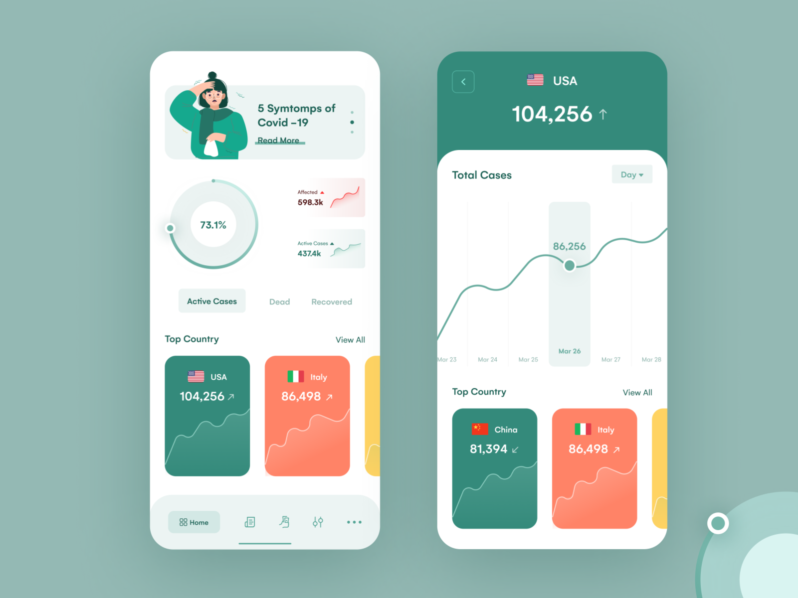

# COVIDE

An Application written in Ionic 5 for tracking COVID-19 status, patients and getting necessary help. Currently working for *India* only.

## Icon


***Credits**: Stay away from him 🙏 by [Gustavo Zambelli](https://dribbble.com/zamax) on [Dribble](https://dribbble.com/shots/10844016-Stay-away-from-him/attachments/2497071?mode=media)*

## Proposed Design



***Credits**: Coronavirus (Covid-19) Dashboard by [Nazirul Hoque 🏆](https://dribbble.com/nazirulhoque) on [Dribble](https://dribbble.com/shots/10847147-Coronavirus-Covid-19-Dashboard/attachments/2500285?mode=media)*

## How to instructions

- Install Ionic to your computer globally.

    ````bash
    sudo npm install -g @ionic/cli
    ````

- Clone this repository

    ````bash
    git clone https://github.com/TheOrangeCoffeeProject/CoVide.git
    ````

- Migrate to the folder and install dependencies

    ````bash
    cd covide && npm install
    ````
- Run the project

    ````bash
    ionic serve
    ````
    
 World data api url: 
   ''''''
   url: 'https://corona.lmao.ninja/countries?sort=country'
   ''''''
